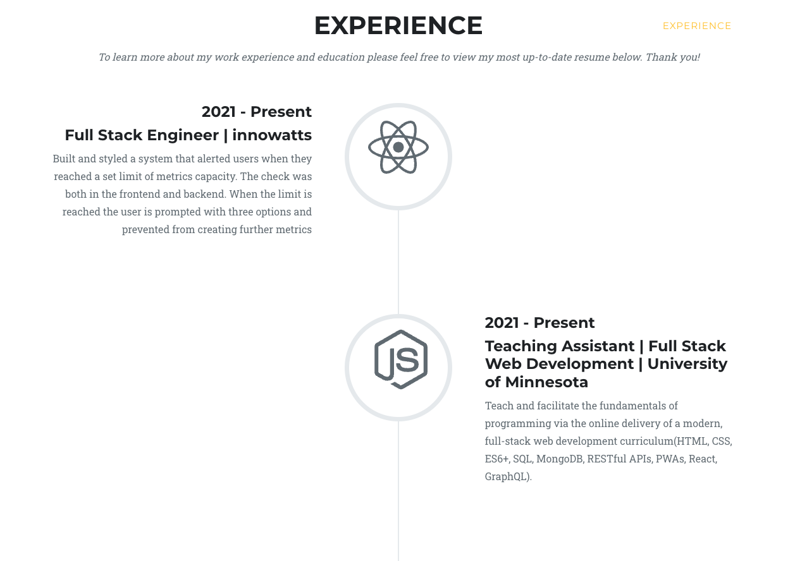

# React Portfolio

## Table of Contents

- [Description](#description)
- [Instalation](#instalation)
- [Tools](#tools)
- [Contact](#contact)
- [License](#license)
- [WebsitePreview](#website preview)

## Description

A display of personal projects using React that facilitate a conversation and welcomes collaboration and connection with others.

## Instalation

- Clone the repo (please reference the links below).

```md
git@github.com:Kimberly-Rodriguez/KR_React_Portfolio.git
```

[Site link]()

## Tools

- This project was built using HTML, CSS, Bootstrap and React principles.

## Contact

Looking forward to staying connected: krodriguez.ucla@gmail.com and GitHub: [Kimberly-Rodriguez](https://github.com/Kimberly-Rodriguez).

## License

Licensed under the [MIT License](LICENSE).

## Website Preview





